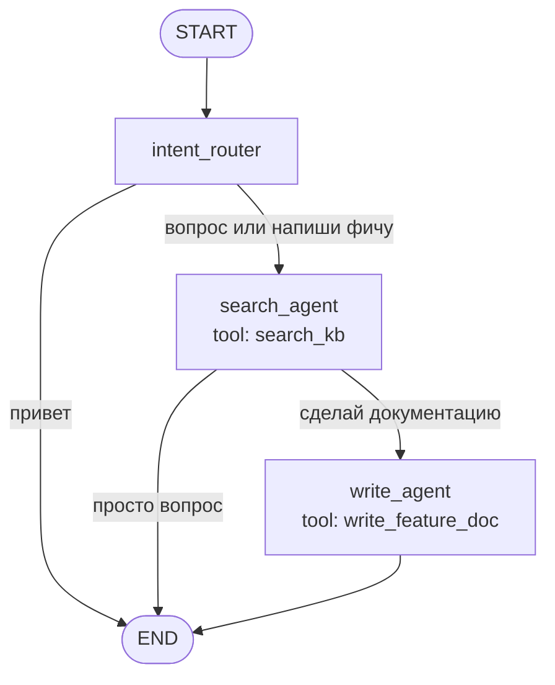
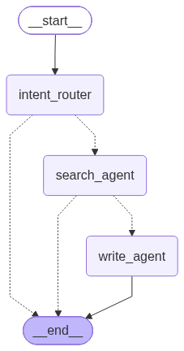

# Схемы агентов DocIntel

## Главная: два агента в Telegram/web

Путь: Telegram → backend `/chats` → `ChatService` → `docintel_graph`.

| Сообщение в Telegram | Что вызывается |
|----------------------|----------------|
| «Как работает импорт из Confluence?» | `search_agent` |
| «Сделай документацию для новой ручки webhook» | `search_agent` → `write_agent` |
| «Привет» | короткий ответ без агентов |

## ReAct (ДЗ Б6.3)

## Prebuilt create_agent

