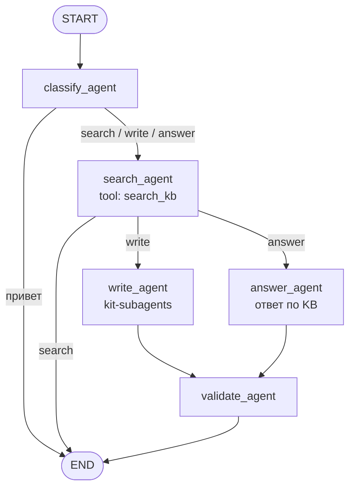
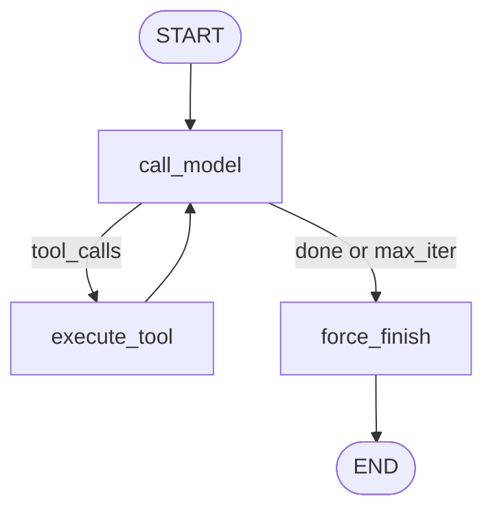
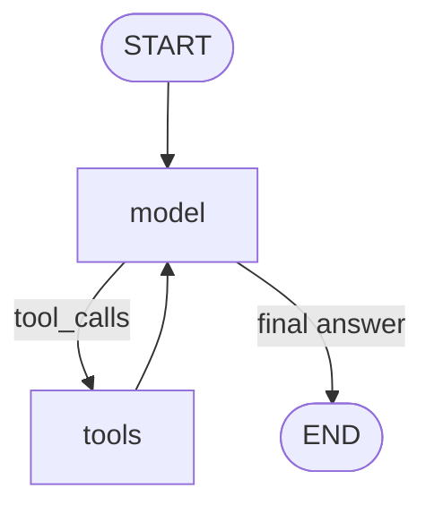

# Схемы агентов DocIntel

## Главная: classify_agent + три сценария

Путь: Telegram → backend `/chats` → `ChatService` → `docintel_graph`.

| Сообщение в Telegram | Сценарий | Что вызывается |
|----------------------|----------|----------------|
| «Найди документ GetLinkedEvents» | search | `search_agent` |
| «Приведи пример ответа для SEND OPERATIONS» | answer | `search_agent` → `answer_agent` → `validate_agent` |
| «Сделай документацию: yield в GetLinkedEvents» | write | `search_agent` → `write_agent` → `validate_agent` |
| «Привет» | chat | короткий ответ без рабочих агентов |

## ReAct (ДЗ Б6.3)

## Prebuilt create_agent

