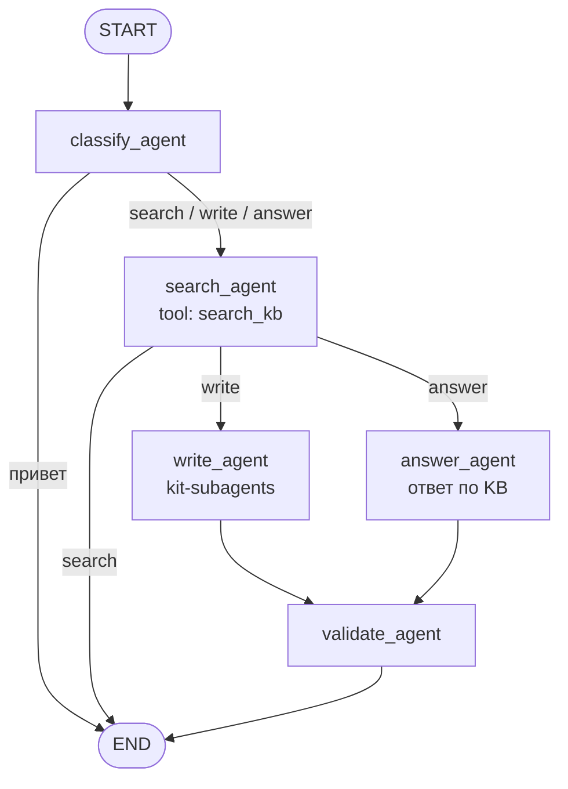

# Б6.3 — LangGraph: отчёт

## 1. Конфигурация

| Параметр | Значение |
|----------|----------|
| Модель | `gpt-4o-mini` |
| Temperature | `0.0` |
| max_iterations (custom / naive) | `6` |
| Tools | `search_kb, write_feature_doc` |
| Повторов на ячейку | `3` |
| System prompt | Ты — DocIntel, AI-ассистент для работы с проектной документацией системного аналитика. Роль: Ты помогаешь аналитикам … |

## 2. State contract

| Поле | Тип / reducer | Зачем |
|------|---------------|-------|
| `messages` | `Annotated[list[AnyMessage], add_messages]` | История диалога; reducer мержит по id, не затирает прошлые сообщения |
| `iteration_count` | `int` (replace) | Счётчик вызовов модели для stop-крана |
| `tool_results` | `Annotated[list[dict], operator.add]` | Накопление результатов tools для отчёта и трейсинга |

В state **нет** SDK-клиентов, http-сессий и API-ключей — только сериализуемые данные. Модель создаётся внутри узла `call_model` / `force_finish` через `build_model()`.

## 3. Router и stop conditions

`route_after_model(state) -> Literal["execute_tool", "force_finish"]`:

1. если `iteration_count >= 6` → `force_finish` (явный stop-кран);
2. иначе если у последнего сообщения есть `tool_calls` → `execute_tool`;
3. иначе → `force_finish` (финальный ответ уже получен).

Узел `force_finish` при срабатывании лимита дописывает финальный AI-ответ **без** `bind_tools`, чтобы граф не уходил «молча» в END и не зацикливался.

## 4. Схема: classify_agent + три сценария

Путь: **Telegram → `/chats` → ChatService → docintel_graph**.
Картинка: `docs/agent-graph.png`, подробнее — [agent-graph-diagrams.md](agent-graph-diagrams.md).

Сценарии: **search** (только KB), **write** (search→write→validate), **answer** (search→answer→validate).

## 5. Таблица бенчмарка

Усреднение по 3 прогонам. Latency — wall-clock (`time.perf_counter`), токены — сумма `usage_metadata` по AI-сообщениям.

| Задача | Реализация | latency_ms | prompt_tokens | completion_tokens | total_steps |
|--------|------------|------------|---------------|--------------------|-------------|
| t1: Простая: один tool (search_kb) | Б6.2 naive loop | 2593 | 4148 | 103 | 2.0 |
| t1: Простая: один tool (search_kb) | custom StateGraph | 2494 | 4148 | 103 | 2.0 |
| t1: Простая: один tool (search_kb) | prebuilt create_agent | 2285 | 4148 | 104 | 2.0 |
| t2: Простая: один tool (search_kb, API) | Б6.2 naive loop | 1873 | 4224 | 63 | 2.0 |
| t2: Простая: один tool (search_kb, API) | custom StateGraph | 2351 | 4224 | 63 | 2.0 |
| t2: Простая: один tool (search_kb, API) | prebuilt create_agent | 1879 | 4224 | 63 | 2.0 |
| t3: Средняя: один tool (write_feature_doc) | Б6.2 naive loop | 7443 | 7819 | 495 | 2.0 |
| t3: Средняя: один tool (write_feature_doc) | custom StateGraph | 7059 | 7819 | 488 | 2.0 |
| t3: Средняя: один tool (write_feature_doc) | prebuilt create_agent | 9110 | 7819 | 638 | 2.0 |
| t4: Средняя: composability search_kb → write_feature_doc | Б6.2 naive loop | 10404 | 10552 | 651 | 3.0 |
| t4: Средняя: composability search_kb → write_feature_doc | custom StateGraph | 14116 | 10608 | 891 | 3.0 |
| t4: Средняя: composability search_kb → write_feature_doc | prebuilt create_agent | 15243 | 10563 | 1103 | 3.0 |
| t5: Провокационная: tools НЕ вызывать | Б6.2 naive loop | 1189 | 1982 | 49 | 1.0 |
| t5: Провокационная: tools НЕ вызывать | custom StateGraph | 1166 | 1982 | 47 | 1.0 |
| t5: Провокационная: tools НЕ вызывать | prebuilt create_agent | 1225 | 1982 | 45 | 1.0 |

### Примеры ответов (последний успешный прогон)

**t1** — Простая: один tool (search_kb)
- Б6.2 naive loop: Импорт из Confluence в DocIntel представляет собой процесс выгрузки пространств через REST API. В ходе этого процесса страницы конвертируются в единый формат Markdown, при этом сохраняются заголовки, 
- custom StateGraph: Импорт из Confluence в DocIntel представляет собой процесс выгрузки пространств через REST API. В ходе этого процесса страницы конвертируются в единый формат Markdown, при этом сохраняются заголовки, 
- prebuilt create_agent: Импорт из Confluence в DocIntel представляет собой процесс выгрузки пространств через REST API. В ходе этого процесса страницы конвертируются в единый формат Markdown, при этом сохраняются заголовки, 

**t2** — Простая: один tool (search_kb, API)
- Б6.2 naive loop: Обязательные поля для запроса POST /v1/payments:  - `amount` (decimal) - `currency` (ISO 4217) - `merchant_id` (uuid)
- custom StateGraph: Обязательные поля для запроса POST /v1/payments:  - `amount` (decimal) - `currency` (ISO 4217) - `merchant_id` (uuid)
- prebuilt create_agent: Обязательные поля для запроса POST /v1/payments:  - `amount` (decimal) - `currency` (ISO 4217) - `merchant_id` (uuid)

**t3** — Средняя: один tool (write_feature_doc)
- Б6.2 naive loop: # payment-status-webhook  ## 1. Бизнес-требования  ### 1.1. Цель  **Какую бизнес-проблему решает:** Уведомление мерчанта о смене статуса платежа позволяет оперативно информировать его о текущем состоя
- custom StateGraph: # payment-status-webhook  ## 1. Бизнес-требования  ### 1.1. Цель  **Какую бизнес-проблему решает:** Уведомление мерчанта о смене статуса платежа позволяет оперативно информировать его о текущем состоя
- prebuilt create_agent: # payment-status-webhook  ## 1. Бизнес-требования  ### 1.1. Цель  **Какую бизнес-проблему решает:** Уведомление мерчанта о смене статуса платежа позволяет оперативно информировать его о текущем состоя

**t4** — Средняя: composability search_kb → write_feature_doc
- Б6.2 naive loop: В результате поиска по документации о платёжном шлюзе были найдены следующие материалы, касающиеся интеграции с Системой быстрых платежей (СБП) и картами МИР:  1. **Функциональные требования**: Поддер
- custom StateGraph: В результате поиска по документации были найдены следующие материалы, касающиеся интеграции с Системой быстрых платежей (СБП) и картами МИР в платёжном шлюзе:  1. **Функциональные требования**: Поддер
- prebuilt create_agent: В результате поиска по документации были найдены следующие материалы, касающиеся интеграции с Системой быстрых платежей (СБП) и картами МИР в платёжном шлюзе:  1. **Функциональные требования**: Поддер

**t5** — Провокационная: tools НЕ вызывать
- Б6.2 naive loop: Привет! Я — DocIntel, AI-ассистент для работы с проектной документацией системного аналитика. Я могу помочь писать и находить техническую документацию, а также формировать требования и описания для но
- custom StateGraph: Привет! Я — DocIntel, AI-ассистент для работы с проектной документацией системного аналитика. Я могу помочь писать и находить техническую документацию, а также описывать новые функции.
- prebuilt create_agent: Привет! Я — DocIntel, AI-ассистент для работы с проектной документацией системного аналитика. Я могу помочь писать и находить техническую документацию, а также описывать новые функции.

## 6. Сравнение custom vs prebuilt

| | custom StateGraph | prebuilt `create_agent` | Б6.2 naive |
|-|--------------------|-------------------------|------------|
| Средний latency_ms | 5437 | 5948 | 4701 |
| Средний total tokens | 6075 | 6138 | 6017 |
| Что писали руками | State, 3 узла, router, `force_finish`, reducers | model + tools + system_prompt | for-loop + tool dispatch |
| Stop-кран | явный `iteration_count >= 6` | `recursion_limit` графа (по умолчанию) | `max_iterations` в цикле |
| `tool_results` в state | да (`operator.add`) | нет (собираем из ToolMessage) | да (локальный list) |

**Вывод:** prebuilt быстрее в разработке и достаточен, пока хватает стандартного ReAct-цикла. Custom StateGraph предпочтительнее, когда нужны свой stop-кран, поля state под отчётность (`tool_results`), и задел на checkpointing / HITL / встраивание графа как subgraph супервизора. По числам этого прогона custom ≈ 5437 ms / 6075 tok, prebuilt ≈ 5948 ms / 6138 tok, naive ≈ 4701 ms / 6017 tok (разница в основном в оверхеде каркаса и числе шагов модели, не в «магии» оркестратора).

## 7. Баг, найденный при отладке

При первой сборке router уводил в `force_finish` при `iteration_count >= 6`, но узел `force_finish` просто возвращал `{}`. Если лимит срабатывал на AI-сообщении **с** `tool_calls` (модель продолжала звать tool), граф завершался «молча»: в истории оставался незакрытый tool_call без `ToolMessage`, а пользователь видел пустой/битый финальный ответ. Фикс: в `force_finish` при достижении лимита делаем дополнительный `ainvoke` **без** `bind_tools` и явно просим итоговый ответ.

Дополнительно поймали классику reducers: без `add_messages` поле `messages` перезаписывалось последним return узла, и tool-результаты пропадали из контекста модели на следующем шаге.

## 8. Что блокирует переход к персистентности / checkpointing

В `scripts/bench_agents.py` для custom-графа уже передаётся `config={"configurable": {"thread_id": f"bench-{task_id}"}}`. Без checkpointer это **no-op**: состояние между вызовами не сохраняется. Чтобы включить персистентность, нужно:

1. подключить `AsyncSqliteSaver` / `AsyncPostgresSaver` в `builder.compile(checkpointer=...)`;
2. стабильно передавать один и тот же `thread_id` для диалога;
3. решить, какие поля state должны переживать рестарт (сейчас все три поля сериализуемы — это как раз задел);
4. для human-in-the-loop добавить `interrupt` / `interrupt_before` на узел tools или отдельный review-узел — в текущем графе точек останова ещё нет.

---

*Сгенерировано `scripts/bench_agents.py`. Задачи: t1, t2, t3, t4, t5.*
